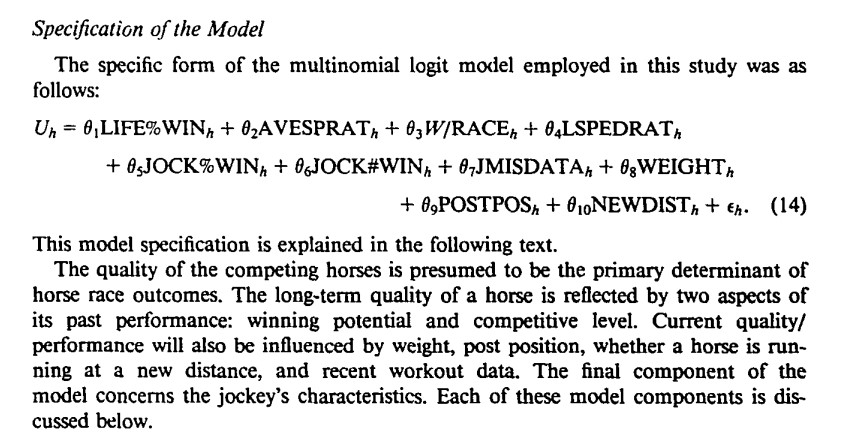
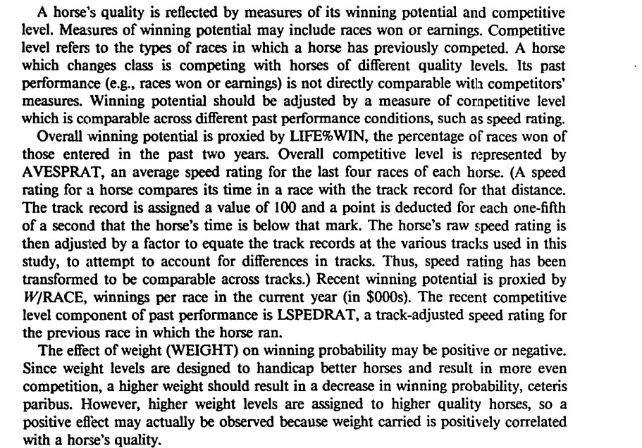
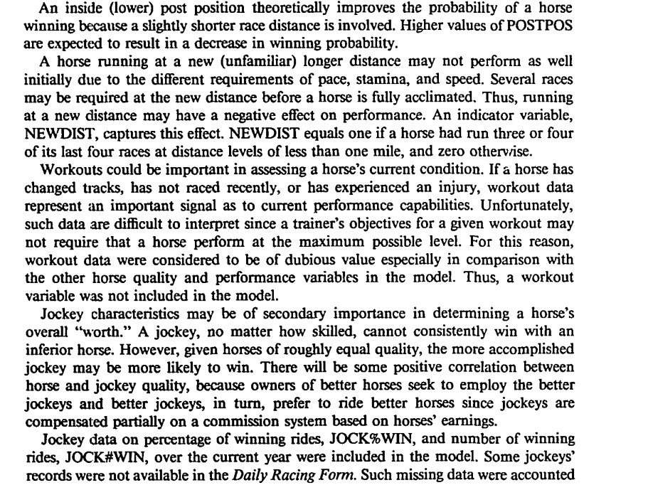
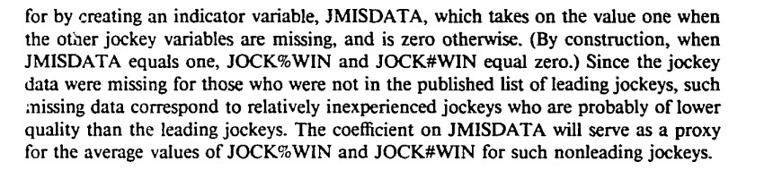

```{r}
library (data.table)
library(survival)
library(tidyverse)
library(zoo)
```


```{r}
# set working directory to directory in which script is stored
script_path <- dirname(rstudioapi::getActiveDocumentContext()$path)
setwd(script_path)
```


```{r}
getwd()
```

Contents
- Horse Racing in Germany: Betting and Takeout
- Benter's Model
- Data
- Features
- Train Data
- Test Data


# 1 Horse Racing in Germany

## 1.1 Betting Market

Germany features two primary types of horse racing: Harness racing and flat racing. Steeplechasing and hurdling have largely faded into history. This notebook will concentrate on flat racing. Betting plays a crucial role in German racing, as a portion of the prize money is funded by the parimutuel betting operator's profits.

Betting in Germany occurs through two primary channels: bookmakers (fixed odds) and the totalizator (parimutuel). For this analysis, we'll focus exclusively on parimutuel odds.


## 1.2 Takeout

In parimutuel betting, the track retains a commission known as takeout. In Germany, the takeout for win and place markets is 15%. Our analysis will concentrate solely on the win market.


# 2 Bill Benter's Approach

Inspired by Bolton and Chapman's (1986) paper, Bill Benter employed a conditional logistic regression model to predict horse racing outcomes in Hong Kong. His innovative approach incorporated the public's estimate, as reflected in betting odds, into his model. Following a similar path, we'll attempt to identify market inefficiencies within German horse racing. 


# 3 Data

The data used in our analysis has been acquired by web scraping. We have gathered german horse racing results since 2002 up until now. But only the results since 2019 will be used in training and testing the model because before 2019 the takeout rate was much higher than 15%. Data before 2019 has however been used to construct the necessary features. Similar features to those mentioned by Bolton and Chapman (1986) have been engineered.

```{r}
data <- readRDS("../data/processed/cleaned_german_racing_data.Rds")
```

LIFE%WIN = hosr730, hosr
AVESPRAT = homean4sprat
W/RACE = homeanearn365
LSPEDRAT = holastsprat
JOCK%WIN = josr365
JOCK#WIN = jowins365
WEIGHT = weight
POSTPOS = hostall


## 3.1 Data Import


```{r}
races <- readRDS("../data/processed/engineered_features.Rds")
```


## 3.2 Filtering the Data

Some jump races are also part of the dataset. But we only use flat races run on turf. We won't analyse stakes races. Instead we concentrate on Handicap races and in particular "Ausgleich IV" races which are lowest class of racing Germany. But those race are run very frequently with many observations per horse in a year. 


DEAD HEATS!!


```{r}
data <- races %>% 
  filter(
    race_class_old == "Ausgleich IV",
    date_time > "2019-01-01 01:00:00",
    race_type == "flat",
    surface == "Turf"
  ) %>% 
  select(
    dg_raceid, win, date_time, hosr730, hosr, homean4sprat, homeanearn365, 
    holastsprat, hoattend, josr365, jowins365, weight, hostall, hono, odds, 
    dg_raceid, dg_horseid, horse, hofirstrace 
  ) %>% 
  filter(
    !is.na(odds)
  )

# homean4sprat missing (different reasons) exclude those races
races_missing_data <- data %>% 
  filter(is.na(homean4sprat)) %>% 
  pull(dg_raceid)

data <- data %>% 
  filter(! dg_raceid %in% races_missing_data)

# find races where stall numbers are missing
races_missing_stall <- data %>%  
  filter(is.na(hostall)) %>% 
  pull(dg_raceid)
data <- data %>% 
  filter(!dg_raceid %in% races_missing_stall)

data <- data %>% 
  arrange(date_time) %>% 
  mutate(holastsprat = na.locf(holastsprat))


```

LIFE%WIN = hosr730, hosr
AVESPRAT = homean4sprat
W/RACE = homeanearn365
LSPEDRAT = holastsprat
JOCK%WIN = josr365
JOCK#WIN = jowins365
WEIGHT = weight
POSTPOS = hostall


# Train Data

```{r}
train_data <- data %>% 
  filter(date_time < "2021-01-01 01:00:00")
```

Model

 + hosr + homean4sprat + homeanearn365 + holastsprat + josr365 + 
    jowins365 + weight + hostall + hono + hofirstrace

```{r}
features <- c(
  "hosr730", "hosr", "homean4sprat", "homeanearn365", "holastsprat", "josr365", 
  "jowins365", "weight", "hostall", "hono", "hofirstrace", "odds"
)

model_formula <- as.formula(
  paste(
    "win",
    paste(paste(features, collapse = " + "), "strata(dg_raceid)", sep = " + "),
    sep = " ~ "
  )
)
print(model_formula)
```


```{r}
model <- clogit(
  win ~ hosr730 + hosr + homean4sprat + homeanearn365 + holastsprat + josr365 + 
    jowins365 + weight + hostall + hono + hofirstrace + odds + 
    strata(dg_raceid),
  data = train_data, method = "exact"
)
summary(model)
```


```{r}
coeffs <- as.vector(summary(model)$coefficients[, 1])
coeffs
```


# Test Data

```{r}
test_data <- data %>% 
  filter(
    date_time > "2021-01-01 01:00:00" 
  ) %>% 
  data.table()
```

Predictions

```{r}
predictions <- test_data[, prediction := as.matrix(test_data[, ..features]) %*% coeffs]
predictions <- predictions %>% 
  group_by(dg_raceid) %>% 
  mutate(
    exp_prediction = exp(prediction),
    sum_exp_prediction = sum(exp_prediction),
    my_prob = exp_prediction / sum_exp_prediction,
    expected_value = my_prob * (odds - 1) - (1 - my_prob)
  ) %>% 
  filter(
    expected_value > 0,
    expected_value == max(expected_value),
    odds < 10
  ) %>% 
  ungroup() %>% 
  mutate(
    earnings = ifelse(
      win == 1, odds - 1, -1
    )
  )

sum(predictions$earnings)
```


```{r}
model$coefficients
```

```{r}

```
```{r}

```
```{r}

```
```{r}

```