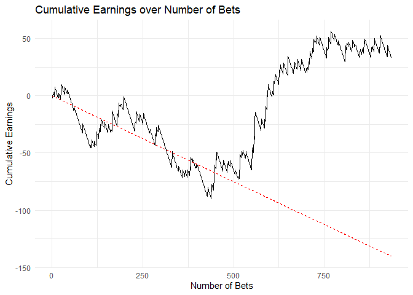
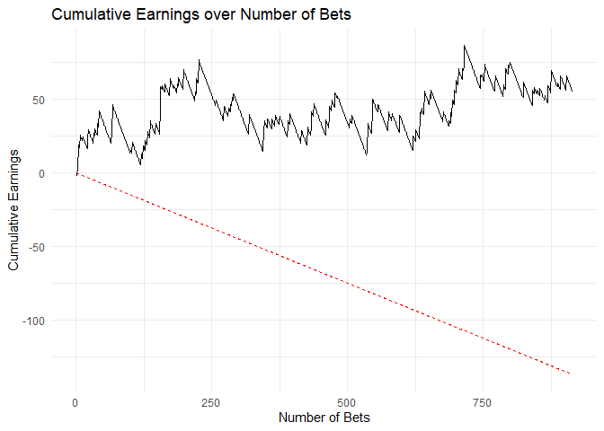

Predicting German Horse Race Outcomes using a Benter-Inspired Model
================

## Introduction

This notebook explores the application of quantitative methods, inspired
by the legendary horse racing bettor Bill Benter, to the German horse
racing market.

Web-scraped data and a conditional logistic regression model will be
leveraged to estimate the probability of each horse winning a race. The
aim is to identify potential market inefficiencies and to assess the
effectiveness of Benter’s approach in the context of German horse
racing.

``` r
library(data.table)
library(survival)
library(tidyverse)
library(zoo)
```

# 1 Horse Racing in Germany

Germany features two primary types of horse racing: Harness racing and
flat racing. Steeplechasing and hurdling have largely faded into
history.[^1] This notebook will concentrate on flat racing.

## 1.1 Betting Market

Betting plays a crucial role in German horse racing, as a portion of the
prize money is funded by the parimutuel betting operator’s profits.[^2]
Betting in Germany occurs through two primary channels: bookmakers
(fixed odds) and the totalizator (parimutuel). For this analysis, the
focus lies exclusively on parimutuel odds.

## 1.2 Takeout

In parimutuel betting, the track retains a commission known as takeout.
In Germany, the takeout for win and place markets is 15%. This analysis
will concentrate solely on the win market.

# 2 Bill Benter’s Approach

Inspired by Bolton and Chapman’s (1986) seminal paper, Bill Benter
employed a conditional logistic regression model to predict horse racing
outcomes in Hong Kong.[^3] His innovative approach incorporated the
public’s estimate, as reflected in betting odds, into his model.[^4]
Following a similar path, we’ll attempt to identify market
inefficiencies within German horse racing.

# 3 Data

This analysis utilizes German horse racing data collected via web
scraping from the official website of Deutscher Galopp e.V. The dataset
encompasses race results, race details, and betting odds spanning from
2002 to the present. However, due to a significantly higher takeout rate
before 2019, only races from 2019 onwards are included in model training
and testing. Data prior to 2019 was leveraged for feature engineering,
drawing inspiration from the work of Bolton and Chapman (1986). The web
scraping process is detailed in the [data_acquisition
folder](../data_acquisition/), while the feature engineering steps can
be found in the [data_processing folder](../data_processing/).

``` r
# Import data
races <- readRDS("../data/processed/engineered_features.Rds")
```

## 3.1 Feature Descriptions

The features used in the model were primarily selected based on existing
literature, common sense, and domain expertise in horse racing.

### Horse-related features

- **`hosr730`**: Horse’s strike rate in the last 2 years
- **`hosr`**: Horse’s career strike rate
- **`homean4sprat`**: Horse’s mean speed rating in the last 4 races
- **`homeanearn365`**: Horse’s mean earnings per race in the last 365
  days
- **`holastsprat`**: Horse’s last speed rating
- **`hofirstrace`**: Indicator if it’s the horse’s first race
- **`hodays`**: Number of days since the horse’s last race
- **`draweffect_median`**: The median estimated disadvantage (in terms
  of lengths) associated with the horse’s starting stall compared to the
  innermost stall
- **`gag`**: Horse’s handicap rating before the race
- **`gagindicator`**: Takes the value 1 if the horse’s current handicap
  rating is lower than its rating at the time of its most recent win, 0
  otherwise
- **`blinkers1sttime`**: Indicator if the horse is wearing blinkers for
  the first time
- **`weight`**: Weight carried by the horse

### Jockey-related features

- **`josr365`**: Jockey’s strike rate in the last 365 days
- **`jowins365`**: Number of wins for the jockey in the last 365 days

### Trainer-related features

- **`trsr`**: Trainer’s strike rate

### Other features

- **`odds`**: Betting odds for the horse

``` r
# Define a vector to store the names of features used in the model
features <- c(
  # Horse-related features
  "hosr730", "hosr", "homean4sprat", "homeanearn365", "holastsprat",
  "hofirstrace", "hodays", "draweffect_median", "gag", "gagindicator", 
  "blinkers1sttime", "weight",
  
  # Jockey-related features
  "josr365", "jowins365", 
  
  # Trainer-related features
  "trsr",
  
  # Other features
  "odds"
)
```

## 3.2 Filtering and Preparing the Data

This section prepares the data for model training and prediction. Jump
races and stakes races are excluded as the focus is on flat races and
specifically “Ausgleich IV” handicap races. “Ausgleich IV” races are the
lowest class of racing in Germany and those races are run very
frequently with many observations per horse in a year. Additionally,
races before 2019 are removed due to a significantly different takeout
rate at that time. The data is further filtered to ensure data integrity
by removing races with missing odds, homean4sprat values, or stall
numbers. Lastly, races with dead heats are excluded and the data is
sorted by date and time.

``` r
# Finding races with dead heats
dead_heat_races <- races %>% 
  group_by(dg_raceid, position) %>%
  filter(position == 1) %>% 
  summarise(
    position1_count = n(),
    .groups = "drop"
  ) %>%
  filter(position1_count > 1) %>% 
  pull(dg_raceid) 

# Finding races where homean4sprat is missing
homean4sprat_missing_races <- races %>% 
  filter(is.na(homean4sprat)) %>% 
  pull(dg_raceid)

# Finding races where hostall is missing
missing_stall_races <- races %>%  
  filter(is.na(hostall)) %>% 
  pull(dg_raceid)


data <- races %>% 
  # Filter races based on type, class, surface, and date
  filter(
    race_type == "flat",
    race_class_old == "Ausgleich IV",
    surface == "Turf",
    date_time > "2019-01-01 01:00:00"
  ) %>% 
  # Select the necessary columns
  select(
    all_of(
      c(
        features,
        "dg_raceid", "date_time", "win", "dg_horseid", "horse", "hostall"
      )
    )
  ) %>%
  # Handle missing values and ensure data integrity
  filter(
    !dg_raceid %in% dead_heat_races,
    !dg_raceid %in% homean4sprat_missing_races,
    !dg_raceid %in% missing_stall_races,
    !is.na(odds)
  ) %>% 
  mutate(
    hodays = ifelse(hofirstrace == 1, 0, hodays)
  ) %>% 
  arrange(date_time) %>% 
  group_by(dg_horseid) %>% 
  # For each horse use last measured speed rating if last speedrating is missing
  mutate(holastsprat = na.locf(holastsprat, na.rm = FALSE)) %>% 
  ungroup()
```

# 4 Training and Testing the Model

The dataset is split into a training set and a test set to evaluate the
model’s performance on unseen data. The training set includes races
before January 1, 2021, while the test set contains races from that date
onwards. This split allows us to assess how well the model generalizes
to new races and avoids overfitting to the training data.

``` r
# Create training dataset using races before 2021
train_data <- data %>% 
  filter(date_time < "2021-01-01 01:00:00")

# Create test dataset using races after 2021
test_data <- data %>% 
  filter(date_time > "2021-01-01 01:00:00") %>% 
  data.table()
```

## 4.1 Training the Model

A conditional logistic regression model (`clogit`) is employed to
predict the probability of a horse winning a race. This model is
wellsuited for analyzing data with multiple observations within groups
(horses within races) and allows us to account for the inherent
dependencies within each race. This approach is consistent with Bill
Benter’s strategy in horse race prediction. But in contrast to Benter’s
two-step approach to incorporate the public estimate (the odds), here a
one-step approach is utilized.

``` r
# Construct the model formula using the selected features
model_formula <- as.formula(
  paste(
    "win",
    paste(paste(features, collapse = " + "), "strata(dg_raceid)", sep = " + "),
    sep = " ~ "
  )
)
print(model_formula)
```

    ## win ~ hosr730 + hosr + homean4sprat + homeanearn365 + holastsprat + 
    ##     hofirstrace + hodays + draweffect_median + gag + gagindicator + 
    ##     blinkers1sttime + weight + josr365 + jowins365 + trsr + odds + 
    ##     strata(dg_raceid)

``` r
# Fit the conditional logistic regression model
model <- clogit(
  model_formula,
  data = train_data, method = "exact"
)

# Print model summary
summary(model)
```

    ## Call:
    ## coxph(formula = Surv(rep(1, 5690L), win) ~ hosr730 + hosr + homean4sprat + 
    ##     homeanearn365 + holastsprat + hofirstrace + hodays + draweffect_median + 
    ##     gag + gagindicator + blinkers1sttime + weight + josr365 + 
    ##     jowins365 + trsr + odds + strata(dg_raceid), data = train_data, 
    ##     method = "exact")
    ## 
    ##   n= 5630, number of events= 524 
    ##    (60 observations deleted due to missingness)
    ## 
    ##                         coef  exp(coef)   se(coef)       z Pr(>|z|)    
    ## hosr730           -2.6031964  0.0740366  1.5838718  -1.644  0.10027    
    ## hosr               1.5842952  4.8758534  1.6590735   0.955  0.33961    
    ## homean4sprat       0.0058641  1.0058813  0.0046976   1.248  0.21191    
    ## homeanearn365      0.0001162  1.0001162  0.0002112   0.550  0.58218    
    ## holastsprat        0.0030170  1.0030215  0.0031465   0.959  0.33764    
    ## hofirstrace        0.3334776  1.3958138  0.5377979   0.620  0.53521    
    ## hodays            -0.0001106  0.9998894  0.0008036  -0.138  0.89054    
    ## draweffect_median -0.0012922  0.9987086  0.0191354  -0.068  0.94616    
    ## gag               -0.0135620  0.9865295  0.0314726  -0.431  0.66653    
    ## gagindicatorTRUE  -0.0449279  0.9560664  0.1300400  -0.345  0.72972    
    ## blinkers1sttime   -0.3136789  0.7307536  0.1802375  -1.740  0.08180 .  
    ## weight            -0.0016044  0.9983969  0.0340307  -0.047  0.96240    
    ## josr365            0.6950807  2.0038708  0.6769128   1.027  0.30450    
    ## jowins365          0.0023511  1.0023538  0.0019387   1.213  0.22525    
    ## trsr               4.4032058 81.7124020  1.2316190   3.575  0.00035 ***
    ## odds              -0.0877171  0.9160200  0.0085094 -10.308  < 2e-16 ***
    ## ---
    ## Signif. codes:  0 '***' 0.001 '**' 0.01 '*' 0.05 '.' 0.1 ' ' 1
    ## 
    ##                   exp(coef) exp(-coef) lower .95 upper .95
    ## hosr730             0.07404   13.50684  0.003321    1.6506
    ## hosr                4.87585    0.20509  0.188732  125.9669
    ## homean4sprat        1.00588    0.99415  0.996663    1.0152
    ## homeanearn365       1.00012    0.99988  0.999702    1.0005
    ## holastsprat         1.00302    0.99699  0.996855    1.0092
    ## hofirstrace         1.39581    0.71643  0.486467    4.0050
    ## hodays              0.99989    1.00011  0.998316    1.0015
    ## draweffect_median   0.99871    1.00129  0.961946    1.0369
    ## gag                 0.98653    1.01365  0.927514    1.0493
    ## gagindicatorTRUE    0.95607    1.04595  0.740965    1.2336
    ## blinkers1sttime     0.73075    1.36845  0.513278    1.0404
    ## weight              0.99840    1.00161  0.933977    1.0673
    ## josr365             2.00387    0.49903  0.531717    7.5519
    ## jowins365           1.00235    0.99765  0.998552    1.0062
    ## trsr               81.71240    0.01224  7.310246  913.3642
    ## odds                0.91602    1.09168  0.900869    0.9314
    ## 
    ## Concordance= 0.738  (se = 0.013 )
    ## Likelihood ratio test= 343.8  on 16 df,   p=<2e-16
    ## Wald test            = 194.2  on 16 df,   p=<2e-16
    ## Score (logrank) test = 219.5  on 16 df,   p=<2e-16

The estimated coefficients are extracted from the model summary for use
in subsequent predictions on the test data.

``` r
# Extract coefficients from the model summary
coeffs <- as.vector(summary(model)$coefficients[, 1])
```

## 4.2 Testing the Model

The performance of the trained model on unseen data will be evaluated by
generating predictions for races in the test set (races after January 1,
2021). Based on these predictions expected values are calculated. A
straightforward betting strategy is to bet on the horse with the highest
positive expected value in a race.

First, the trained model is applied to the test data to generate
predictions.

``` r
predictions <- test_data[
  , prediction := as.matrix(test_data[, ..features]) %*% coeffs
]
```

Races in which predictions for some or all of the horses are missing
will be excluded.

``` r
predictions_missing_races <- predictions %>% 
  filter(is.na(prediction)) %>% 
  pull(dg_raceid)

predictions <- predictions %>% 
  filter(!dg_raceid %in% predictions_missing_races)
```

### Identifying Bets

Next, the expected value for each horse based on the model’s predicted
probabilities and the actual betting odds is calculated. The expected
value represents the average profit or loss one can anticipate from a
bet on that horse. The predictions are filtered to identify the horse
with the highest positive expected value in each race, as laid out with
the straightforward betting strategy described above.

``` r
bets <- predictions %>% 
  group_by(dg_raceid) %>% 
  mutate(
    exp_prediction = exp(prediction),
    sum_exp_prediction = sum(exp_prediction),
    my_prob = exp_prediction / sum_exp_prediction,
    expected_value = my_prob * (odds - 1) - (1 - my_prob)
  ) %>% 
  filter(
    expected_value > 0,
    expected_value == max(expected_value)
  )  %>% 
  ungroup() %>% 
  arrange(date_time) %>% 
  mutate(
    earnings = ifelse(
      win == 1, odds - 1, -1
    ),
    cumulative_earnings = cumsum(earnings)
  ) 

total_bets <- nrow(bets)
total_earnings <- sum(bets$earnings)

# Print the results
cat(
  "Total number of bets:", total_bets, "\n",
  "Total earnings:", total_earnings
)
```

    ## Total number of bets: 935 
    ##  Total earnings: 33

Over the test period, our strategy identified 935 potentially profitable
bets. Assuming a uniform bet size of €1.00, the strategy would have
generated cumulative earnings of €33.

## 4.3 Outperforming the Market or just a few lucky Wins?

The cumulative earnings over the number of bets are plotted to assess
the overall profitability and the pattern of wins and losses over the
test period.

``` r
# Calculate expected earnings for each bet (assuming 1 unit bet and 15% takeout)
expected_earnings <- -0.15 * 1:nrow(bets) 

# Create the plot
ggplot(bets, aes(x = 1:nrow(bets))) +  
  geom_line(aes(y = cumulative_earnings)) + 
  geom_line(aes(y = expected_earnings), color = "red", linetype = "dashed") + 
  labs(title = "Cumulative Earnings over Number of Bets",
       x = "Number of Bets",
       y = "Cumulative Earnings") +
  theme_minimal() 
```

<!-- -->

By conducting a bootstrap hypothesis test it is assessed if the observed
earnings are significantly different from what one would expect due to
chance.

``` r
# Set a seed for reproducibility 
set.seed(123) 

# Number of bootstrap replicates
n_bootstraps <- 10000  

# Function to calculate total earnings from a bootstrap sample
calculate_earnings <- function(data, indices) {
  resampled_data <- data[indices, ]
  sum(resampled_data$earnings)
}

# Calculate observed total earnings 
observed_earnings <- sum(bets$earnings) 

# Calculate the expected loss due to takeout 
total_bet_amount <- nrow(bets) 
takeout_rate <- 0.15
expected_loss <- total_bet_amount * takeout_rate

# Perform bootstrapping for actual earnings
boot_results_earnings <- boot::boot(data = bets, statistic = calculate_earnings, R = n_bootstraps)

# Extract the bootstrap distribution of earnings
boot_earnings <- boot_results_earnings$t

# Calculate the p-value (one-sided test)
p_value <- mean(boot_earnings <= -expected_loss)  

# Print the results
cat(
  "Observed Earnings:", observed_earnings, "\n",
  "Expected Loss (with 15% takeout):", expected_loss, "\n",
  "p-value:", p_value, "\n"
)
```

    ## Observed Earnings: 33 
    ##  Expected Loss (with 15% takeout): 140.25 
    ##  p-value: 0.0274

The bootstrap hypothesis test yields a p-value of 0.0274. This p-value
is less than the commonly used significance level of 0.05.

The low p-value (0.0274) indicates that the observed earnings of €33 are
statistically significantly higher than what one would expect if the
betting strategy’s performance were purely due to chance, considering
the 15% takeout.

The bootstrap hypothesis test provides strong evidence that the observed
earnings are not merely due to chance.

``` r
# Create a histogram of the bootstrapped earnings
ggplot(data.frame(earnings = boot_earnings), aes(x = earnings)) + 
  geom_histogram(binwidth = 5, fill = "lightblue", color = "black") +  
  # Add a red vertical line for observed earnings
  geom_vline(xintercept = observed_earnings, color = "red", linetype = "dashed") +
  # Add a blue vertical line for expected loss
  geom_vline(xintercept = -expected_loss, color = "blue", linetype = "dashed") +  
  labs(
    title = "Bootstrap Distribution of Earnings",
    x = "Earnings",
    y = "Frequency"
  ) +
  theme_minimal()
```

<!-- -->

# 5 Conclusion

The trained model demonstrated statistically significant predictive
power, as evidenced by the bootstrap hypothesis test. The cumulative
earnings plot further suggests that the betting strategy based on the
model’s predictions has the potential to generate profits beyond what
would be expected by chance, given the takeout rate.

However, it’s important to acknowledge the limitations of this analysis.
The model was trained and tested on a specific subset of races
(“Ausgleich IV” handicap races on turf), and its performance might not
generalize to other types of races or different market conditions.
Moreover, the betting market is dynamic and subject to fluctuations, so
continued monitoring and adaptation of the strategy would be necessary
for sustained success.

A significant challenge in employing this kind of betting strategy
arises from the nature of parimutuel betting markets. Placing a large
bet on a horse can cause its odds to drop, potentially eliminating any
predicted advantage.

The model could be improved by using k-fold cross-validation and an
information criterion (e.g., AIC) for variable selection. Additionally,
developing new and more sophisticated features or trying other methods
like random forests could enhance its predictive power.

[^1]: For a more detailed overview of the different types of horse
    racing, see the [Wikipedia
    article](https://en.wikipedia.org/wiki/Horse_racing#Types_of_horse_racing).

[^2]: For more information on parimutuel betting, see the [Wikipedia
    article](https://en.wikipedia.org/wiki/Parimutuel_betting).

[^3]: See Bolton, R.N., & Chapman, R.G.(1986). Searching for positive
    returns at the track: A multinomial logistic regression model for
    handicapping horse races. Management Science, 32(8), pp. 1040-1060.

[^4]: See Benter, W. (1994). Computer-based horse race handicapping and
    wagering systems: A report. In: Efficiency of Racetrack Betting
    Markets, pp. 183-198
